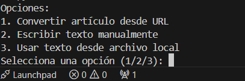
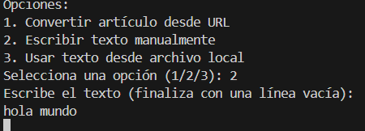
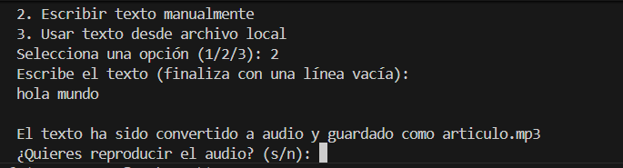

# Texto a Voz Avanzado

Este proyecto convierte texto en audio en formato MP3 usando Python. Permite obtener texto de un artículo web, un archivo local o introducirlo manualmente en la consola, generando un archivo de audio reproducible en tu sistema operativo.

---

## Características

- Convertir artículos desde URL usando `newspaper3k`.
- Convertir texto desde un archivo local.
- Escribir texto manualmente en la consola.
- Guardar el audio generado con **nombre y ruta personalizables**.
- Reproducción automática del audio según el sistema operativo (Windows, macOS, Linux/WSL).
- Manejo robusto de errores: texto vacío, fallos al descargar artículos o leer archivos.

---

## Requisitos

- Python 3.8 o superior
- Bibliotecas Python:

```bash

pip install nltk newspaper3k gTTS
Para Linux, opcional: instalar xdg-utils si no está presente para abrir archivos con xdg-open

---
## Captura previa







---
## Estructura recomendada del proyecto
texto_a_voz/
├── texto_a_voz.py       # Script principal
├── README.md
└── audios/              # Carpeta opcional para guardar tus MP3


Nota: La carpeta audios/ se puede crear para organizar tus archivos de salida.

## Uso

1. Ejecuta el script:

python texto_a_voz.py


2. Selecciona una opción para obtener el texto:

1: Convertir artículo desde URL.

2: Escribir texto manualmente.

3: Usar texto desde archivo local.

3. Introduce el nombre o ruta del archivo de audio donde quieres guardarlo:

mi_audio.mp3
./audios/mi_audio.mp3


4. Si no agregas .mp3 al final, se añadirá automáticamente.

El script generará el archivo de audio y lo reproducirá automáticamente según tu sistema operativo.

## Ejemplo de ejecución
Opciones:
1. Convertir artículo desde URL
2. Escribir texto manualmente
3. Usar texto desde archivo local
Selecciona una opción (1/2/3): 2

Escribe el texto (finaliza con una línea vacía):
Hola, este es un ejemplo.
<Enter>

Introduce el nombre o ruta del archivo de audio (ej: mi_audio.mp3 o ./audios/mi_audio.mp3):
./audios/ejemplo.mp3
Audio generado en: ./audios/ejemplo.mp3

Notas

En Linux pueden aparecer advertencias sobre VDPAU o PipeWire. No afectan la reproducción del audio.

Compatible con Windows, macOS y Linux/WSL.

Para rutas largas o nombres con espacios, se recomienda usar comillas ("./audios/mi audio.mp3").

Contribuciones

Si quieres mejorar el proyecto (soporte de idiomas, velocidad de voz, etc.), crea un fork y un pull request. Todo aporte es bienvenido.
```
